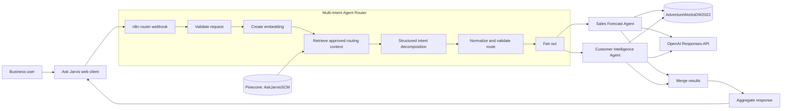
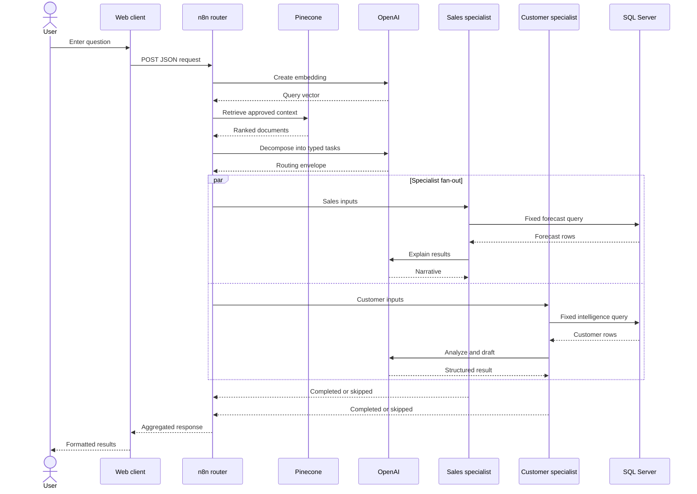

# Ask Jarvis Solution Architecture

## 1. Objective

Ask Jarvis applies a router-pattern agent architecture to supply-chain analytics. One public n8n workflow interprets a natural-language request and coordinates two bounded specialist workflows. SQL Server supplies current facts, Pinecone supplies approved semantic guidance, and OpenAI performs structured intent decomposition and grounded explanation or drafting.

The design separates orchestration, deterministic calculation, semantic knowledge, and language generation. No language model directly controls database execution.

## 2. Logical architecture



## 3. Components

| Component | Technology | Responsibility |
|---|---|---|
| Web client | HTML, CSS, JavaScript | Capture questions and format results |
| Orchestration | n8n Community Edition | Validate, retrieve, route, execute subworkflows, and aggregate |
| Language intelligence | OpenAI API | Embeddings, structured routing, grounded explanation, and drafting |
| Semantic knowledge | Pinecone | Approved definitions, rules, policies, relationships, and examples |
| Analytical facts | SQL Server / `AdventureWorksDW2022` | Authoritative sales, product, date, and customer data |


## 4. Agent responsibilities

### Router

The router validates the webhook payload, embeds the question, retrieves Pinecone guidance, requests a strict structured decomposition from OpenAI, normalizes the routing result, invokes both specialists with typed inputs, and aggregates completed and skipped results.

Both subworkflows receive the routing envelope. Each specialist checks its enable flag and returns either a completed result or an explicit skipped result. The same topology therefore supports single-specialist and overlapping requests.

### Sales Forecast and Trend Analysis Agent

When `run_sales` is true, a fixed T-SQL template combines Internet and Reseller sales, joins the date and product hierarchy, applies an optional subcategory filter, aggregates monthly revenue, and produces a seasonal baseline for the requested horizon. OpenAI explains only those rows and is instructed not to invent confidence or sales values.

### Customer Intelligence and Campaign Agent

When `run_customer` is true, deterministic code validates the requested actions and filters. A fixed query calculates recency, frequency, spend, preferred category, segment, risk, and campaign eligibility. OpenAI performs only the assigned analysis and drafting actions. Results containing email drafts require human approval.

## 5. Knowledge and data architecture

```text
Pinecone: durable semantic knowledge
  - Table and relationship descriptions
  - Metric and forecast definitions
  - Segmentation and risk rules
  - Communication policies
  - Data-quality rules and verified examples

SQL Server: authoritative changing facts
  - Sales transactions and monthly totals
  - Product attributes
  - Calendar dates
  - Customer purchase behavior

OpenAI: reasoning over supplied context
  - Intent decomposition
  - Explanation of calculated results
  - Controlled campaign drafting
```

Pinecone is not a warehouse replica. This prevents stale analytical facts and reduces customer-data exposure. Namespace `AskJarvisSCM` and metadata filters isolate approved Week 3 knowledge and support retrieval by agent, analysis type, channel, metric, and policy.

## 6. Request sequence



## 7. Routing contract

| Field | Architectural role |
|---|---|
| `run_sales`, `run_customer` | Boolean execution gates |
| `sales_task`, `customer_task` | Specialist-scoped instructions |
| `customer_actions` | Allow-listed customer operations |
| `forecast_months` | Horizon constrained to 1–12 months |
| `top_n` | Customer result limit constrained to 1–100 |
| `customer_key` | Optional customer selector |
| `product_subcategory` | Optional exact subcategory; channel names are normalized away |
| `purchase_period` | Allow-listed relative purchase period |
| `promotion_category` | User-supplied campaign context |

Execute Sub-workflow mappings must preserve native types. The string `"true"` is not equivalent to Boolean `true`, and a serialized JSON array is not equivalent to an n8n array.

## 8. Trust boundaries

| Boundary | Controls |
|---|---|
| Browser to n8n | Validation, HTTPS, authentication, CORS, and rate limiting |
| User text to routing | Structured schema, deterministic intent guards, and allow-listed inputs |
| Router to specialists | Trigger schemas, explicit mappings, and enable flags |
| n8n to SQL Server | Fixed T-SQL templates and read-only credentials |
| Pinecone to prompts | Namespace isolation, `approved = true`, metadata filters, and no live facts |
| SQL results to OpenAI | Data minimization, row limits, and context-grounded prompts |
| Draft to campaign use | `human_approval_required`; no automatic sending |
| Credentials to exports | n8n credential references; no secrets in JSON or client code |

## 9. Failure handling and observability

- Reject an invalid or missing `message` during validation.
- Surface Pinecone, OpenAI, and SQL connectivity failures at the responsible node.
- Inspect the specialist trigger when enable flags appear missing or false.
- Normalize channel terms such as Internet and Reseller instead of treating them as subcategories.
- Preserve output and return a no-data explanation when SQL finds no matching rows.
- Use n8n execution history to locate failed nodes rather than fabricating a response.
- Verify webhook mode, activation, URL, and CORS for browser failures.

Production telemetry should include correlation ID, node duration, routing decision, retrieved document IDs, SQL row count, token usage, error category, and approval status without logging secrets or unnecessary customer data.

## 10. Deployment view

```text
User browser
    |
    | HTTPS
    v
Static web client
    |
    | HTTPS webhook
    v
n8n Community Edition
    |-- OpenAI API over HTTPS
    |-- Pinecone over HTTPS
    `-- SQL Server database connection
```

For local development, serve the client with Live Server and use the n8n test URL while listening. For persistent use, activate the router and use its production webhook. The specialist workflows must be saved and selected in the router's Execute Sub-workflow nodes.

## 11. Design decisions

- **Router pattern:** clear ownership plus multi-intent fan-out.
- **Fixed SQL templates:** deterministic and auditable database operations.
- **Pinecone for knowledge, not facts:** semantic grounding without a stale analytical replica.
- **Structured OpenAI outputs:** stable routing and result contracts.
- **Explicit skipped results:** one aggregation path for single- and multi-agent requests.
- **Human approval:** separates content drafting from consequential sending.
- **Seasonal baseline:** transparent and explainable for the project scope.

## 12. Future enhancements

- Add forecast backtesting, error metrics, and validated predictive models.
- Add evaluations for routing, retrieval, groundedness, and policy compliance.
- Add centralized error handling, retries, and dashboards.
- Add authenticated sessions and role-based customer-data access.
- Add safe conversational state for follow-up questions.
- Schedule Pinecone refreshes with catalog-version management.
- Add a formal campaign approval workflow and audit trail.

